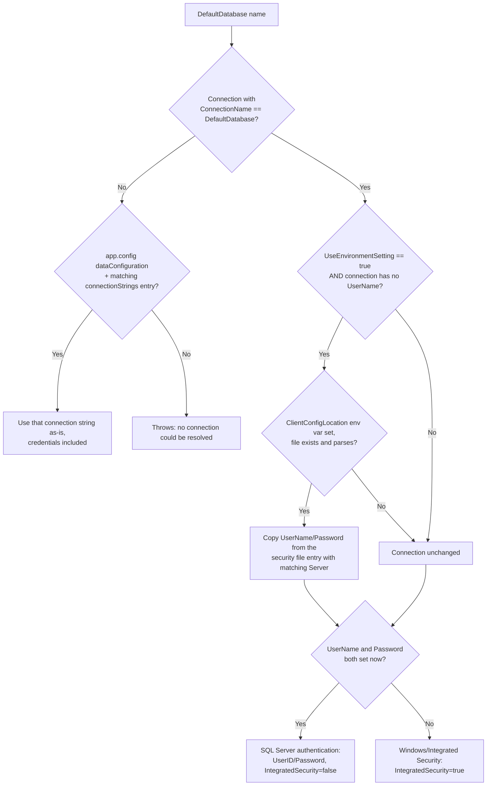

# Konfidence.SqlHostProvider

MS SQL database access, via `Konfidence.SqlDataAccess`/`Microsoft.Data.SqlClient` instead of the old enterprise libraries. Configured with `app.config` and `SqlClientSettings.json`, and able to manipulate app.config settings directly or in memory. Used by my ClassGenerator and its generated artifacts.

Part of the [Konfidence.BaseClasses](https://github.com/a3helmich/Konfidence.BaseClasses) collection of libraries.

## What is in it

- **`AddSqlHostProviderServices(..)`** — a `IServiceCollection` extension that registers everything this library provides into an existing host's container
- **`DependencyInjectionFactory`** — builds a standalone `IServiceProvider` wired up with `SqlClient`, `SqlClientRepository`, `DatabaseStructure` and `IClientConfig`, reading configuration from `SqlClientSettings.json` plus command-line overrides
- **`SqlAccess/SqlClient` + `SqlClientRepository`** — implement `IBaseClient`/`IDataRepository` against MS SQL: the get/save/delete/list stored procedures and schema-existence checks generated for a data item
- **`SqlAccess/ClientConfig`** (+ `ClientSettings`, `ConfigConnectionString`) — connection configuration bound from `SqlClientSettings.json`, including reading and writing settings straight from and to `app.config`
- **`SqlConnectionManagement/IConnectionManagement` + `ConnectionManager`** — points the named connections declared in the host configuration at a database and server, and selects which one is active. Injectable; the older static `ConnectionManagement` is still there for existing callers
- **`SqlDbSchema/DatabaseStructure`** — returns a description of a database: its tables, columns, types, primary keys and indexes. The basis for the ClassGenerator's code generation

`DatabaseStructure` works by temporarily installing helper stored procedures in the target database and removing them again. Those helpers get a name unique to each run and are dropped in a `finally`, so concurrent introspection of the same database is safe and a failed run leaves nothing behind.

Targets **net9.0** and **net10.0**.

## How a connection is resolved



Given a `DefaultDatabase` name, `SqlClientRepository.GetDatabase()` resolves the actual connection in this order:

1. **A matching entry in `DataConfiguration:Connections`** — bound onto `ClientConfig` from `SqlClientSettings.json` (or whatever `IConfiguration` source was supplied), matched by `ConnectionName == DefaultDatabase`. `SqlClientRepository.BuildConnectionString` then picks the auth mode from that entry:
   - `UserName` and `Password` both set → SQL Server authentication (`UserID`/`Password`, `IntegratedSecurity = false`).
   - Either left empty → Windows/Integrated Security (`IntegratedSecurity = true`), no credentials needed.
2. **No matching connection at all** → falls back to `AppConfigDefaultDatabaseProvider`, which reads the legacy `app.config` `<dataConfiguration>`/`<connectionStrings>` sections directly and uses whatever connection string is written there as-is, credentials included. Throws if that's absent too.

### Where the username/password on a connection entry come from

- **Written directly into the config file** — `UserName`/`Password` set straight on that connection's entry in `SqlClientSettings.json`. Plain text, alongside everything else.
- **An external security file, opted into per connection** — when `ClientConfig.UseEnvironmentSetting` is `true` and the matched connection has no `UserName`, `ConnectionManagement.CopySqlSecurityToClientConfig` reads a *separate* JSON file and copies `UserName`/`Password` onto every in-memory connection whose `Server` matches. Keeps credentials out of the deployed config and out of source control.
  - The file's path comes from the `ClientConfigLocation` environment variable (`EnvironmentSqlSecurityFileLocator`), read at the User scope first. Nothing is read if the variable isn't set or the file doesn't exist.
  - This runs once, during `AddSqlHostProviderServices` (`ClientConfig.SetSqlApplicationSettings()`), so it only ever changes the in-memory `ClientConfig` — never the file on disk.
- **Neither set** → `BuildConnectionString` falls back to Windows/Integrated Security automatically; a connection entry with no credentials is not an error.

### Setting up the external security file

All of the following need to be true at once, or the override is silently skipped and the connection falls back to whatever is already in the main config:

1. **`SqlClientSettings.json`** (or whichever config source `ClientConfig` is bound from) has `"UseEnvironmentSetting": true` under `DataConfiguration`, and the matched connection entry has no `UserName` set.
2. **The `ClientConfigLocation` environment variable** is set to the full path of the security file, on the machine actually running the app. User-scope wins over Machine-scope, which wins over Process-scope, so a per-user override always takes priority.
3. **The file at that path exists** and deserializes as `ClientSettings` — i.e. it needs the same `DataConfiguration.Connections` shape as `SqlClientSettings.json` itself, just with credentials filled in:

   ```json
   {
     "DataConfiguration": {
       "Connections": [
         {
           "Server": "sqlserver01",
           "UserName": "svc_myapp",
           "Password": "..."
         }
       ]
     }
   }
   ```

4. **`Server` matches** — the copy is keyed purely on `Server`, not `ConnectionName` or `Database`. Any connection in the main config whose `Server` equals `sqlserver01` gets these credentials, regardless of what database or connection name it uses. `Database`/`ConnectionName` in the security file itself are never read and can be omitted.

Because the match is by server rather than by connection, one security file can supply credentials for every connection in `SqlClientSettings.json` that points at the same server — useful for keeping one shared secrets file per machine/environment outside of source control, referenced by every app that connects to that server.

### The legacy app.config writer

`ConnectionManagement.SetActiveConnection`/`SetApplicationDatabase` (and the injectable `ConnectionManager`) edit an *existing* named connection string entry in the running app's own `app.config` — swapping in a `Database`/`Server`, or changing which named connection is the default. They never touch credentials, and only apply to classic .NET Framework apps that ship an `app.config` with a matching `<connectionStrings>` entry already in place.

## Full documentation

The other libraries in the collection, and build/test instructions, are in the
[README on github.com](https://github.com/a3helmich/Konfidence.BaseClasses#readme).
